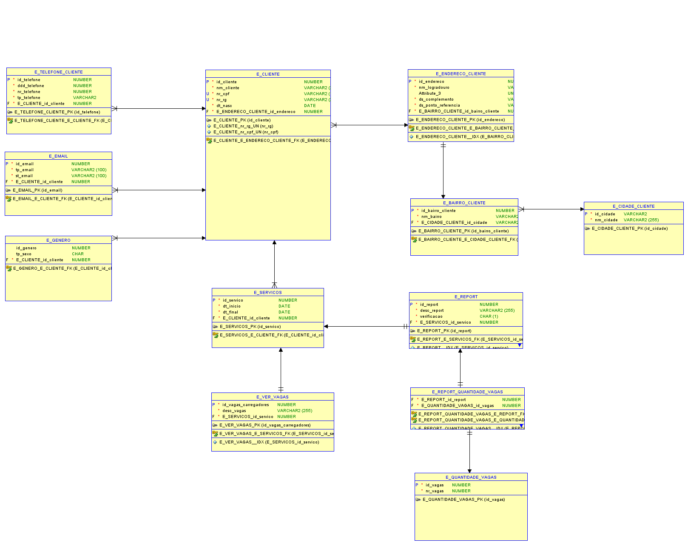
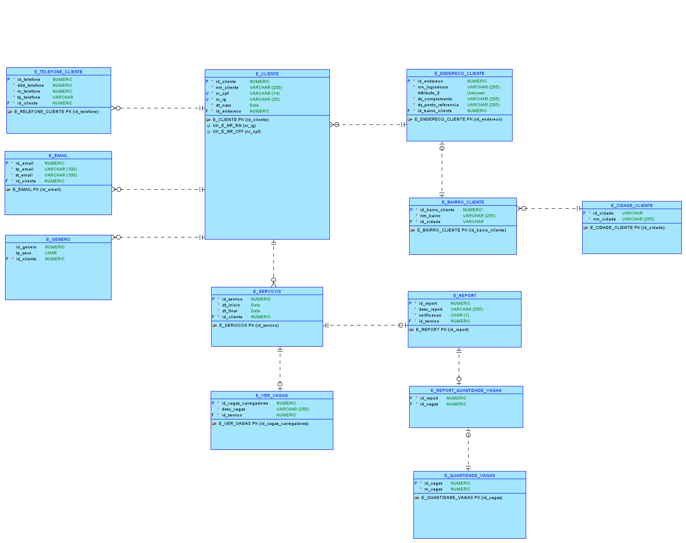
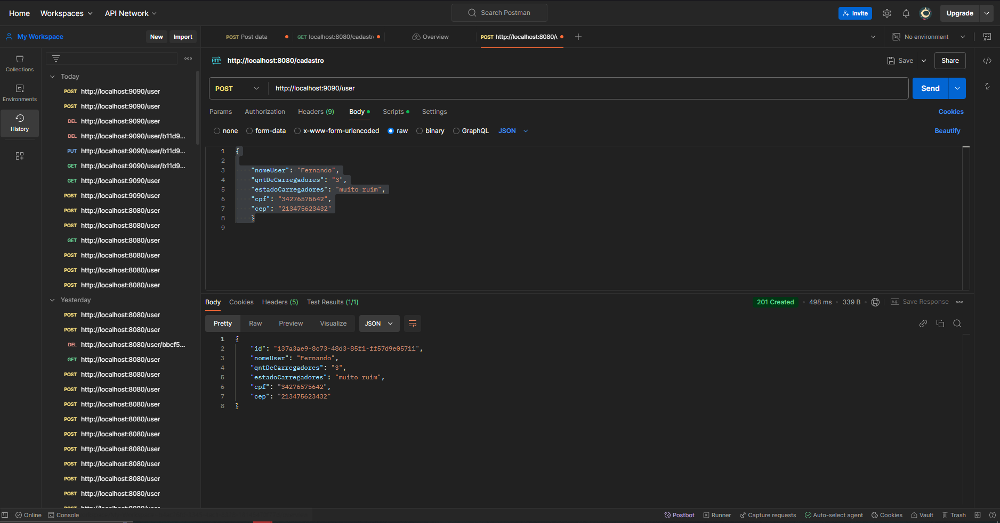
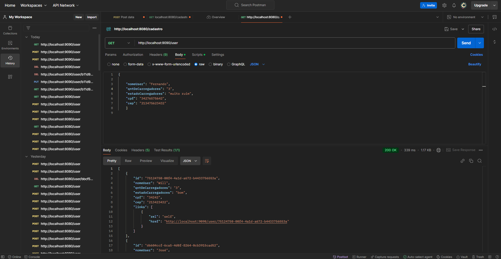

# CHALLENGE_JAVA_ADVANCED - Aplicação para Cadastro de Clientes e Endereço

## Integrantes:
- **Murilo Ferreira Ramos** - RM553315
- **Pedro Luiz Prado** - RM553874
- **William Kenzo Hayashi** - RM552659

## Distribuição de Atividades
A divisão das atividades foi realizada conforme as disciplinas da grade curricular:

- **Murilo**: DevOps Tools, Cloud Computing, Compliance, Quality Assurance, e Tests.
- **Pedro**: Mobile Application Development, e Advanced Business Development With .NET e  Disruptive Architectures IoT, IOB, Generative AI
- **William**: Java Advanced, Mastering Relational e Non-Relational Database.

##
- [DOCUMENTAÇÃO JAVA](Documentos/Documentação/DOCUMENTAÇÃO%20JAVA.pdf)

## Rodagem da Aplicação
Para executar a API, siga os passos abaixo:

1. Execute a classe `GlobalSolutionApplication`.
2. Aguarde a inicialização completa da aplicação.
3. Após a inicialização, você poderá realizar chamadas GET, POST, PUT, e DELETE.

A aplicação está conectada a um banco de dados hospedado na conta do William, utilizando as credenciais presentes no arquivo de configuração. A porta configurada para a aplicação é a **9090**.

## Diagramas
### Diagrama Relacional

### Diagrama de Lógico

## Link do Vídeo de Apresentação
- [Link do Vídeo](https://youtu.be/Y9_4OHeAdfs)

## Listagem de Endpoints

#### Criar Cliente
- **Método**: POST
- **URL**: `http://localhost:9090/user`
- **Parâmetros**: 
  - **Exemplo de Body**:
{
    "nomeUser": "Liya",
    "qntDeCarregadores": "4",
    "estadoCarregadores": "Muito bom",
    "cpf": "34276575642",
    "cep": "213475623432"
    }

- **Respostas**:
  - **200 OK**: Cliente criado com sucesso
  - **400 Bad Request**: Dados inválidos

#### Obter Todos os Clientes
- **Método**: GET
- **URL**: `http://localhost:9090/user`
- **Respostas**:
  - **200 OK**: Retorna a lista de clientes
  - **404 Not Found**: Nenhum cliente encontrado

#### Obter Cliente por ID
- **Método**: GET
- **URL**: `http://localhost:9090/user/{id}`
- **Parâmetros**: 
  - **Path Variable**: `id` do cliente
- **Respostas**:
  - **200 OK**: Retorna os dados do cliente
  - **404 Not Found**: Cliente não encontrado

#### Atualizar Cliente
- **Método**: PUT
- **URL**: `http://localhost:9090/user/{id}`
- **Parâmetros**: 
  - **Path Variable**: `id` do cliente
  - **Body**: JSON com os dados atualizados do cliente
- **Respostas**:
  - **200 OK**: Cliente atualizado com sucesso
  - **404 Not Found**: Cliente não encontrado
  

#### Deletar Cliente
- **Método**: DELETE
- **URL**: `http://localhost:9090/user/{id}`
- **Parâmetros**: 
  - **Path Variable**: `id` do cliente
- **Respostas**:
  - **200 OK**: Cliente deletado com sucesso
  - **404 Not Found**: Cliente não encontrado

